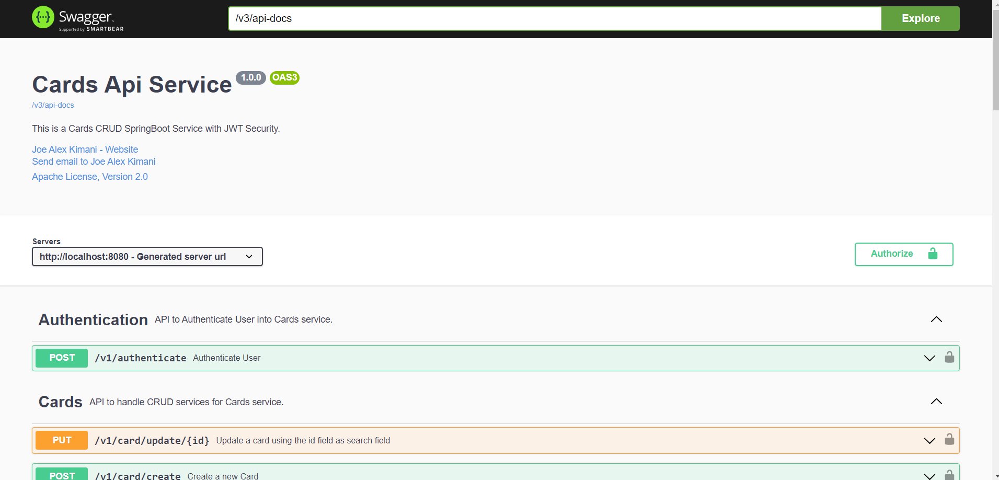

## Building the Application
### Logging
- For local deployment, it is available on STDOUT using the format configured in [logback-spring.xml](../src/main/resources/logback-spring.xml)

## Setup Guide
### Requirements

For building and running the application you need:

- [JDK 17](https://www.oracle.com/java/technologies/javase/jdk17-archive-downloads.html)

### **Here is our quickstart guide.**
* Clone the repo
```shell  
git clone git@github.com:AlexKimani/cards-api.git  
```  
* When you attempt to clone the repository, you receive the error message. [Fix – git@github.com : permission denied](https://dev.classmethod.jp/articles/fix-gitgithub-com-permission-denied-publickey-fatal-could-not-read-from-remote-repository/)
* [Install docker](https://docs.docker.com/get-docker/). Ensure that docker is always running.

## Running and testing
* via IDE for local debugging (recommended)
* Run all the required Services on Docker `docker-compose up`.  
  Please follow the troubleshooting section if you are facing any issue
* Start app via IDE (SpringBoot: `com.logicea.cardsapi.CardsApiApplication`). [Not Recommended]
* Build and Test
* `./mvnw clean package`
* Integration tests will use test configs
* Run
* via Docker
* `docker-compose build service-cards`.

### How to test the service
* Run the application via command: `docker compose up`, this will create the MySQL Database service and Cards Application on docker
* MySQL runs on internal port `3306` and exposed port `3308`.
* The service will create a database using  [Liquibase Migration](https://docs.spring.io/spring-boot/docs/3.1.3/reference/htmlsingle/index.html#howto.data-initialization.migration-tool.liquibase) to create the database and add the initial data.

### Available Service Endpoints
All endpoints are documented on Swagger API: `{base-url}/swagger-ui.html` with JWT Authentication Support
* Authentication API: [POST] `{base-url}/v1/authenticate`
* Create Card: [POST] `{base-url}/v1/card`
* Get card by id: [GET] `{base-url}/v1/card/id/{id}`
* Get user cards: [GET] `{base-url}/v1/card/all`
* Get All Cards: Admin [GET] `{base-url}/v1/card/admin`
* Update a card: [PUT] `{base-url}/v1/card/update/{id}`
* Delete a Card: [DELETE] `{base-url}/v1/card/delete`
* Delete All cards: Admin [DELETE] `{base-url}/v1/card/admin/delete/all`

### Testing the application
* You can run all the unit and integrations tests by running the command `mvn clean test`
* Tests run on Docker `test containers` therefore docker should be running

### API Testing
* Open the SwaggerUI endpoint: eg `http://localhost:8080/swagger-ui/index.html#/`
* Sample view: 
* Click on the **Authentication** tab, the default admin credentials are pre-populated.
* Generate the auth token and copy it to your clipboard.
* Click on **Authorize**, add the token and click on `Authorize`.
* Now you can test the other endpoints with the token until it expires.

**Note:** For the Member user, the username is `member@test.com` and password is: `password`